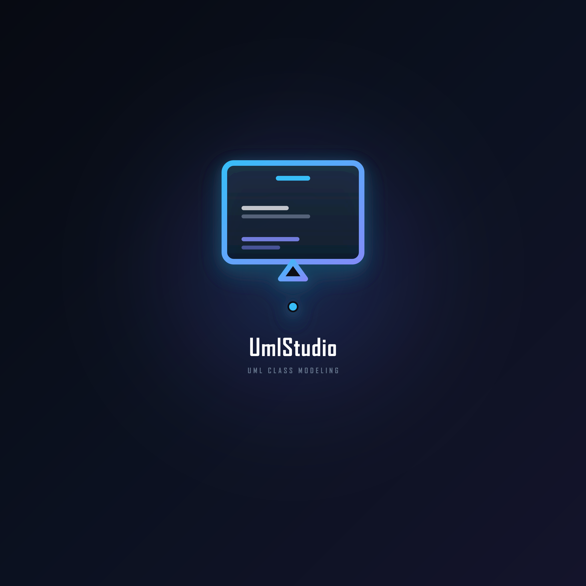
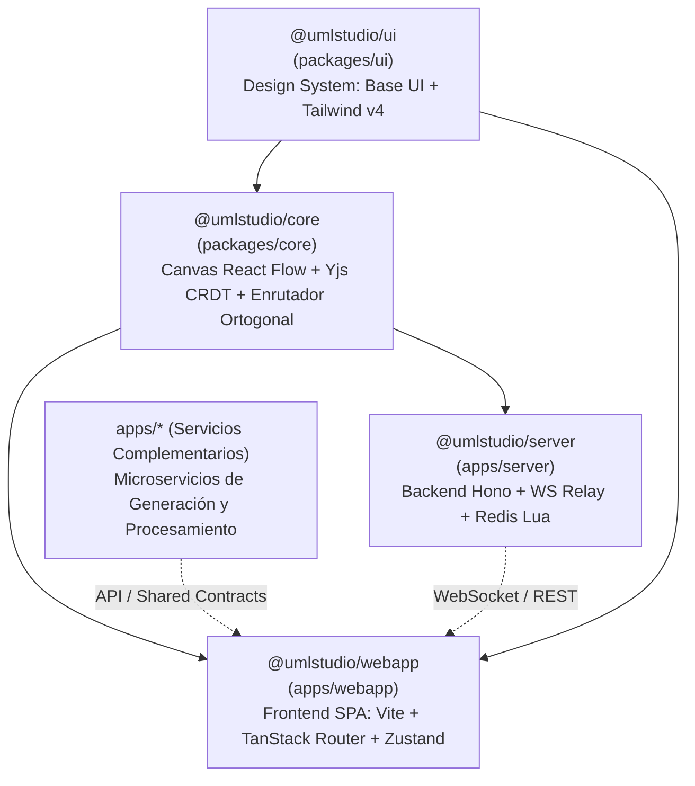

# UmlStudio — UML Class Diagram Modeling Studio

<div align="center">



**Entorno de ingeniería visual interactivo, reactivo y colaborativo dedicado única y exclusivamente a Diagramas de Clases UML.**

[](https://nodejs.org/)
[](https://pnpm.io/)
[](https://react.dev/)
[](https://www.typescriptlang.org/)
[](https://tailwindcss.com/)
[](LICENSE)

</div>

---

## 1. Visión y Propósito del Proyecto

`UmlStudio` es una suite de modelado visual interactivo de nivel profesional, diseñada y desarrollada como proyecto de ingeniería de software bajo la metodología **PUDS (Proceso Unificado de Desarrollo de Software / RUP)**.

### 1.1 Delimitación Estricta de Dominio

- **Exclusividad de Diagramas de Clases**: El sistema está optimizado única y exclusivamente para el modelado de **Diagramas de Clases UML** conforme a la especificación estándar **OMG UML 2.5**.
- **Elementos Soportados**:
  - **Entidades**: Paquetes (`Package`), Clases estándar (`Class`), Clases Abstractas (`AbstractClass`), Interfaces (`Interface`) y Enumeraciones (`Enumeration`).
  - **Compartimentos**: Anatomía formal de 3 compartimentos (Nombre/Estereotipo, Atributos tipados y Operaciones/Métodos con parámetros).
  - **Relaciones UML**: Herencia/Generalización, Realización/Implementación, Asociación bidireccional y unidireccional, Agregación, Composición y Dependencia.
- **Cero Diagramas Ajenos**: No incluye diagramas de Casos de Uso, Actividad, Secuencia ni BPMN en el lienzo para preservar la máxima pureza semántica del modelo de clases.

---

## 2. Arquitectura del Monorepo (`pnpm workspace`)

El proyecto está construido como un monorepo modular de alto rendimiento gestionado con `pnpm` (versión 11+) y catálogos de dependencias unificados:



### 2.1 Desglose de Paquetes y Aplicaciones

1. **`@umlstudio/core`** (`packages/core/`):
   - **Propósito**: Núcleo agnóstico del modelador UML.
   - **Tecnologías**: React 19, `@xyflow/react` (React Flow 12), Yjs (CRDT de sincronización), `@dnd-kit`, TypeScript.
   - **Capacidades**: Renderizado de nodos de clases en canvas, solver de enrutamiento geométrico ortogonal (A*) con arcos de salto (*line jumps\*), reconciliación Yjs y exportación a SVG vectorial, PNG, PDF y JSON Schema (`uml-model-4.schema.json`).

2. **`@umlstudio/ui`** (`packages/ui/`):
   - **Propósito**: Sistema de diseño atómico y librería de componentes reutilizables.
   - **Tecnologías**: `@base-ui/react` (Radix Primitives), TailwindCSS v4 con `@tailwindcss/cli`, CVA (`class-variance-authority`).
   - **Componentes**: Botones, modales de diálogo, menús desplegables, tooltips, selectores de color y paneles flotantes.

3. **`@umlstudio/server`** (`apps/server/`):
   - **Propósito**: Backend HTTP REST y servidor relay de comunicación colaborativa en tiempo real.
   - **Tecnologías**: Hono v4 (HTTP en puerto `8000`), WebSocket Server (`ws://localhost:4444`), Redis (puerto `6379`), JSDOM headless para exportación server-side.
   - **Versionado Atómico**: Scripts programados en Lua bajo la librería `umlstudio` (`commit_snapshot`, `restore_version`, `list_versions_before`).

4. **`@umlstudio/webapp`** (`apps/webapp/`):
   - **Propósito**: Aplicación cliente SPA completa para el usuario final.
   - **Tecnologías**: Vite 8, React 19, `@tanstack/react-router`, Zustand v5, `@tanstack/react-query` (puerto `5173`).
   - **Rutas Principales**:
     - `/`: Dashboard de diagramas locales y compartidos.
     - `/local/:id`: Editor interactivo en almacenamiento offline local (IndexedDB).
     - `/shared/:id`: Editor colaborativo multiusuario en tiempo real conectado al servidor.

5. **Preparación para Aplicaciones Políglotas (`apps/*`)**:
   - El workspace de `pnpm` ignora de forma nativa las carpetas dentro de `apps/*` que no tienen `package.json`, lo que permite incorporar microservicios en otros ecosistemas (ej. generadores de código o scripts de análisis) sin alterar el pipeline de Node.js.

---

## 3. Síntesis de Arquitectura bajo la Metodología PUDS (Modelo 4+1)

El desarrollo del software se rige por las vistas arquitectónicas de Philippe Kruchten:

### 3.1 Vista Lógica y Metamodelo de Dominio

El modelo matemático y AST del diagrama desacopla la visualización de la semántica de datos:

- `UMLModel`: Contenedor raíz que serializa versión, tamaño del canvas, mapa de elementos y mapa de relaciones.
- `UMLElement`: Entidad de modelado (Clase, Interfaz, etc.) con sus compartimentos estructurados (lista de atributos con visibilidad y tipo, lista de operaciones con parámetros y tipo de retorno).
- `UMLRelationship`: Representa conexiones entre elementos, almacenando extremos, camino ortogonal de puntos, multiplicidades (`0..*`, `1..1`) y roles de asociación.

### 3.2 Vista de Procesos y Concurrencia

- **Sincronización en Tiempo Real sin Conflictos (CRDT)**: Los clientes intercambian deltas binarios mediante el protocolo `y-protocols` a través de WebSocket. Las operaciones sobre mapas y arreglos convergentes garantizan coherencia eventual sin bloqueos.
- **Procesamiento Geométrico Fuera del Hilo Principal**: Para evitar congelamientos en diagramas densos, el cálculo de trayectorias ortogonales y la evitación de colisiones se delegan a Web Workers dedicados.
- **Transacciones Atómicas en Redis**: Las operaciones de captura de versión y reversión (_rollback_) se ejecutan directamente en la memoria del motor Redis mediante funciones Lua, evitando condiciones de carrera entre múltiples colaboradores.

### 3.3 Vista de Despliegue y Puertos de Red

Topología de servicios y puertos físicos mapeados:

| Servicio                | Puerto | Protocolo | Función                                                   |
| :---------------------- | :----: | :-------: | :-------------------------------------------------------- |
| **Frontend WebApp**     | `5173` |   HTTP    | Servir la aplicación cliente en el navegador              |
| **Backend REST API**    | `8000` |   HTTP    | Endpoints de consulta de snapshots, salud y exportaciones |
| **WebSocket Relay**     | `4444` |    WS     | Canal bidireccional de actualización colaborativa         |
| **Base de Datos Redis** | `6379` |    TCP    | Persistencia transaccional de snapshots y estado de salas |

---

## 4. Persistencia y Bases de Datos

El sistema implementa una estrategia de almacenamiento híbrido adaptada a dos modos de uso:

### 4.1 Persistencia Distribuida en Servidor (Redis 7+)

- **Motor**: Redis 7+ en contenedor Docker (`redis:alpine`).
- **Librería Lua `umlstudio`**:
  - `commit_snapshot`: Genera un hash inmutable y registra el estado binario con timestamp monótono.
  - `restore_version`: Restaura el estado de la sala a un punto anterior y sincroniza a los usuarios conectados.
  - `list_versions_before`: Consulta paginada del historial cronológico para el panel lateral de versiones.

### 4.2 Persistencia Local Offline (IndexedDB)

- **Motor**: IndexedDB del navegador web gestionado mediante la librería `idb`.
- **Almacén (`diagrams`)**: Permite a los usuarios diseñar diagramas privados de forma local en la ruta `/local/:id`, con guardado automático, ordenamiento por última modificación y exportación a archivos `.json`.

---

## 5. Sistema de Diseño Visual y Estándar UML

La interfaz de `UmlStudio` adopta la estética **"Precision Technical Studio"**:

### 5.1 Principios Visuales

- **Modo Oscuro Técnico**: Fondo pizarra/obsidiana (`#090D18`, `#0F172A`), bordes sutiles en degradé cian-índigo (`#38BDF8`, `#6366F1`) y cuadrícula técnica de puntos.
- **Tipografía Canónica**: Familia tipográfica oficial **Inter** alojada en `assets/fonts/` e incrustada en las exportaciones vectoriales.
- **Micro-interacciones**: Transiciones suaves de 150ms con curvas bezier, lienzo responsivo y controles flotantes con efecto de desenfoque (_glassmorphism_).

### 5.2 Especificación Visual de Elementos UML

- **Marcadores de Visibilidad**:
  - `+` (Público): Color cian/verde accesible.
  - `-` (Privado): Color rojo coral sobrio.
  - `#` (Protegido): Color ámbar técnico.
  - `~` (Paquete / Default): Color pizarra neutro.
- **Terminaciones de Aristas de Relación**:
  - **Herencia**: Línea sólida con flecha triangular hueca cerrada orientada a la clase base.
  - **Realización**: Línea discontinua con flecha triangular hueca cerrada orientada a la interfaz.
  - **Agregación**: Línea sólida con rombo hueco en el extremo contenedor.
  - **Composición**: Línea sólida con rombo relleno en el extremo contenedor fuerte.
  - **Dependencia**: Línea discontinua con flecha abierta orientada al elemento requerido.

---

## 6. Replicación e Instalación Local

### 6.1 Requisitos del Sistema

- **Node.js**: `>= 22.0.0`
- **pnpm**: `>= 11.8.0`
- **Docker Desktop**: En ejecución (necesario para el contenedor de base de datos Redis local).

### 6.2 Paso 1: Instalación de Dependencias

```bash
pnpm install
```

### 6.3 Paso 2: Iniciar el Stack Completo de Desarrollo

Ejecuta el siguiente comando en la raíz del repositorio:

```bash
pnpm dev
```

El script orquestador (`scripts/dev.mjs`) realiza automáticamente y de forma concurrente:

1. Comprueba si el contenedor Docker de Redis está activo; si no, lo inicia y espera su confirmación con `scripts/wait-for-redis.mjs`.
2. Compila los tokens CSS y componentes de `@umlstudio/ui`.
3. Inicia el compilador en modo observador de `@umlstudio/core`.
4. Levanta el backend Hono en `http://localhost:8000` y el relay WebSocket en `ws://localhost:4444`.
5. Inicia el servidor de desarrollo Vite del frontend en `http://localhost:5173`.

---

## 7. Scripts y Comandos Disponibles

```bash
# Desarrollo y Orquestación
pnpm dev                     # Inicia el stack completo (Docker Redis + Core Watch + Server + WebApp)
pnpm dev:lib                 # Compila la librería del editor en modo watch
pnpm dev:server              # Inicia el backend Hono en modo watch
pnpm dev:webapp              # Inicia la aplicación web cliente en modo watch
pnpm start:localdb           # Levanta únicamente el contenedor Docker de Redis

# Compilación de Producción
pnpm build                   # Compila todos los paquetes del monorepo
pnpm build:lib               # Compila la librería del editor @umlstudio/core
pnpm build:server            # Compila el backend @umlstudio/server
pnpm build:webapp            # Compila la aplicación cliente @umlstudio/webapp

# Calidad, Pruebas y Formateo
pnpm test                    # Ejecuta suites de pruebas unitarias con Vitest
pnpm lint                    # Comprueba reglas de estilo y errores con ESLint v10
pnpm lint:fix                # Corrige incidencias automáticas de linting
pnpm format                  # Formatea todos los archivos del proyecto con Prettier
```

---

## 8. Licencia

Este proyecto está bajo la licencia **MIT**. Ver el archivo [LICENSE](LICENSE) para más detalles.

---

<div align="center">
Desarrollado para el Examen Parcial de Ingeniería de Software — <b>UmlStudio</b>.
</div>
